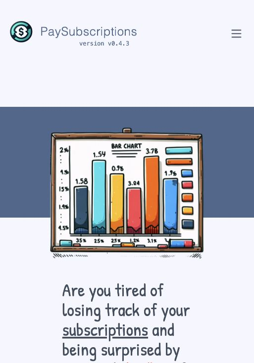
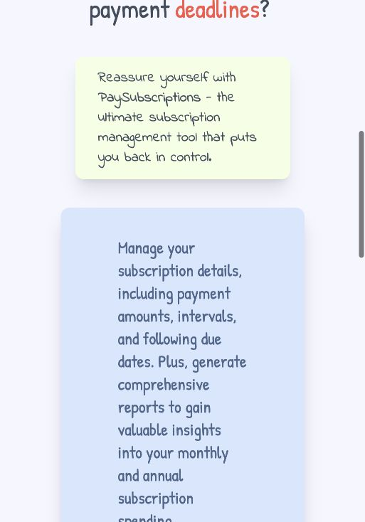
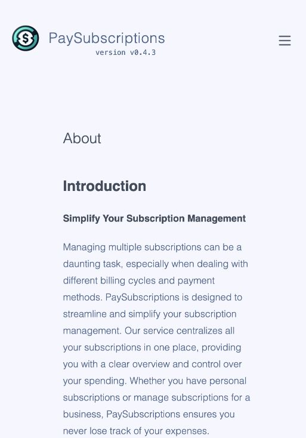
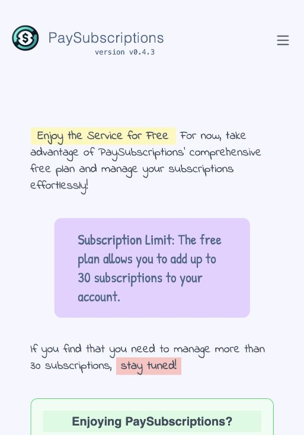
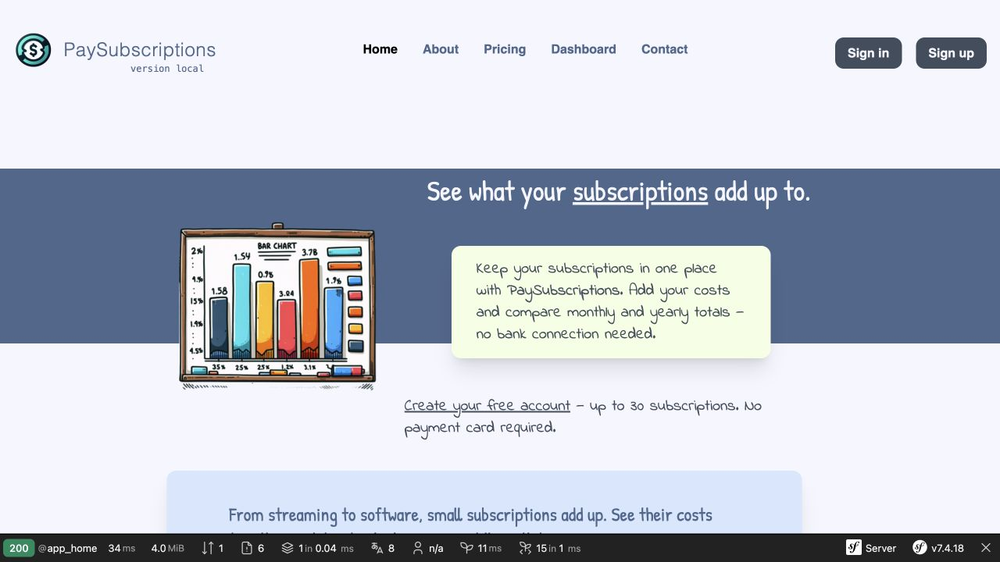
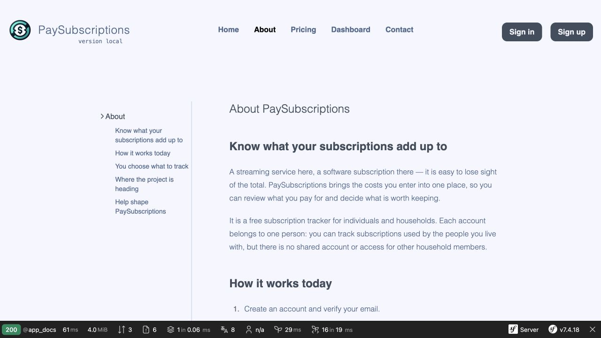
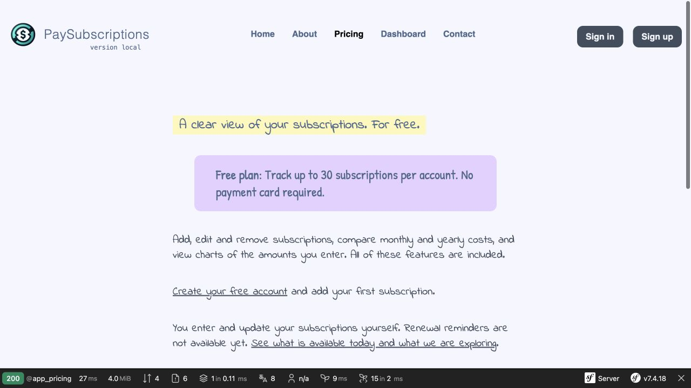

# Design Ideas

Status: **ideas for a separate design process**, not an approved design, implementation plan, or list of commitments. Recorded on 2026-09-22, after reviewing Home, About, and Pricing. This task changed copy and its semantics; the existing layout, illustrations, typography, and stylesheet were left in place.

## Goal

A visitor should quickly understand what they get today, see the actual product, and find a straightforward path to creating an account. The core value of the current version: a subscription cost summary. Reminders and an upcoming-costs preview are a v1 direction, not an available feature.

Reference point: [earlier competitor analysis](docs/research/paysubscriptions-v1-competitors-2026-09-06.md) and current decisions [#22](https://github.com/lbacik/paysubscriptions/issues/22) and [#30](https://github.com/lbacik/paysubscriptions/issues/30). A free tracker without bank integration alone is not enough of a differentiator. The ideas below are meant to help demonstrate usefulness and credibility — they do not imply measured conversion gains.

## Home — ideas

- **Benefit and getting-started copy before the illustration on a narrow screen.** In the existing view, a lot of whitespace and a large chart illustration appear first; the headline only begins in the lower portion of the screen. In a future design, the first glance should answer "what is this for, how much does it cost, how do I start". Evidence: step 1 below.
- **An actual app preview instead of an illustration that implies financial charts.** Show a short list of sample subscriptions and what the monthly/annual equivalent means. Label demo data explicitly. Do not show a calendar, reminders, currencies, or other features as working until they exist.
- **One dominant get-started button.** The current copy revision adds a plain "Create your free account" link; a future design can give it clear hierarchy, with the limit and no-card-required note nearby. Alternative path: "See how it works". For a logged-in user — return to their own list.
- **Shorter opening block and fewer decorative containers.** The illustration, colour band, green panel, blue panel, and varied typefaces compete for attention. Keep the friendly character, but choose one strong accent and a calmer hierarchy. This is a direction to explore, with no palette or component choices made.
- **Short process demo.** Consider an "add → compare → update" sequence instead of further general statements about financial control.

## About — ideas

- **A trust page rather than a documentation look.** The current template shows a sidebar documentation menu on wide screens. Consider a simpler layout: the user's problem, what the product does today, the person maintaining it, contact, and plans separately. Evidence: step 2 and local preview below.
- **Clear separation of "Available today" from "Exploring next".** The roadmap as a short supplementary block, with no dates, progress bars, or implied certainty of delivery. The existing product should remain the main reason to sign up.
- **Concrete credibility signals.** Once a privacy policy is written and published, surface the link and a concise explanation of data and analytics. Do not add "bank-level security", "fully private", full-encryption promises, or no-data-sharing claims based solely on the absence of bank integration. Decisions #30 and the ADRs are not yet a published policy.
- **A real creator story.** If the owner wants to make it public, briefly explain the motivation and how the product is sustained. Do not invent customer quotes, user counts, savings figures, or partnerships.

## Pricing — ideas

- **One offer, without mimicking a multi-tier SaaS.** Consider a clear "Free" block, the limit, a short scope, and a way to start. There is currently one free plan; do not design fictional Pro/Business tiers or a billing-period toggle. Evidence: step 3.
- **Questions answered directly next to the offer.** Do you need a card? What does the limit cover? Does the product pull data automatically? What if I need more entries? The new copy addresses these questions; a future design can make them easier to scan.
- **Project support as a secondary option.** A donation should not look like a paid upgrade or a required step to use the product. Keep a clear separation between voluntary contribution and account scope.

## Shared elements — ideas

- **Readability on mobile.** Reduce accumulated margins and padding inside narrow columns. In the current Home, descriptions sometimes wrap to just a few words per line. Idea: a wider text area and a predictable element order, to be verified in a separate responsive design pass.
- **Handwritten font as an accent.** Keep the warm brand character; consider a plain, readable font for longer descriptions, offer terms, and numbers. No font or type scale has been chosen.
- **Newsletter and support request after the main action.** The current newsletter points to a different project (`gprodb.com`), which may distract and raise questions about the mailing topic. Before changing its messaging, clarify the actual newsletter scope; do not promise PaySubscriptions-only updates if the list does not guarantee that. Any change to the form or subscriber list is a separate scope.
- **Consistent navigation language.** Consider "Create free account" as the single get-started label, with a less prominent "Sign in". Version numbers and elements aimed at the project maintainer may be lower priority than the value proposition for a new visitor.
- **Accessibility as part of a future design pass.** Check contrast, keyboard focus, the newsletter form label, text zoom, reflow, and motion reduction for decorative illustrations. The shared template code is missing `lang` and meta viewport; include these in a separate accessibility/responsiveness audit. Screenshots alone do not confirm WCAG compliance.

## Review material

Journey: a new user discovers Home → reads About → checks Pricing → opens registration. Public pages and local rendering of the new copy were reviewed. Production screenshots show the existing narrow browser viewport; the local preview shows a wider one — these are not a pixel-perfect before/after comparison or a simulation of a specific phone.

### 1. Home — the benefit needed clarification

Strength: consistent, friendly character. Weakness: the illustration dominates the start of the message, and the subsequent description is long and generic. Reading the public content also surfaced "Customizable Notifications", despite no reminder implementation in the local code. The new copy removes that claim.

### 2. About — too few trust-building specifics

Strength: contact with the maintainer. Weakness: the generic description repeats Home marketing and targets businesses, instead of explaining real day-to-day use. The new copy explains the personal account, manual entries, costs, development direction, and current analytics.

### 3. Pricing — the limit was clear, the next step was not

Strength: the 30-subscription limit is visible. Weakness: "for now" and "stay tuned" do not explain the terms or the next action. The new copy states the plan's contents, the absence of a paid upgrade, and the optional nature of support.

### Copy revision preview

This is the existing layout with new copy, not a proposed new design. Local rendering of all three pages was verified, along with the limit sourced from the application constant, the Home → About → Pricing link flow, and the transition to the registration form. No account was created, no forms were submitted, and no conversion was tested.

Limitations: an assessment of content and selected views, not a full accessibility, security, or all-breakpoints audit. Changing copy may alter section heights; the precise layout, mockups, design choices, and their implementation remain a separate process.
